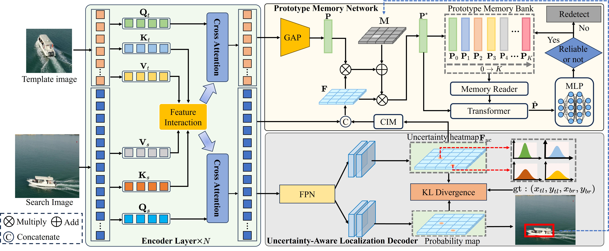

# UncTrack

The official implementation of the TIP 2024 paper [**UncTrack: Reliable Visual Object Tracking with
Uncertainty-Aware Prototype Memory Network**]()

[[Models and Raw results]](https://drive.google.com/drive/folders/1wfK1SP1N7YRyv7BWlYHFSuxT2WINvlHM?usp=sharing) (Google Driver)  
[[Models and Raw results]](https://pan.baidu.com/s/1fdu1Ds5vByW8i2OKwRTtYA?pwd=4409) (Baidu Driver: 4409)



## Install the environment
Use the Anaconda
```
conda create -n unctrack python=3.7
conda activate unctrack
bash install.sh
```

## Data Preparation
Data should be prepared in the following format:
```
-- lasot
   |-- airplane
   |-- basketball
   |-- bear
    ...
-- got10k
   |-- test
   |-- train
   |-- val
-- coco
   |-- annotations
   |-- train2017
-- trackingnet
   |-- TRAIN_0
       -- anno
       -- frames
   |-- TRAIN_1
    ...
   |-- TRAIN_11
   |-- TEST
-- nat2021
   |-- test
       -- anno
       -- data_seq
       -- list.txt
-- uav123
   |-- anno
       -- UAV123
   |-- data_seq
       -- UAV123
   |-- frame
-- otb100
   |-- Basketball
    ...
```

## Set project paths
Run the following command to set paths for this project
```
python tracking/create_default_local_file.py --workspace_dir . --data_dir ./data --save_dir .
```
After running this command, you can also modify paths by editing these two files
```
lib/train/admin/local.py  # paths about training
lib/test/evaluation/local.py  # paths about testing
```

## Train UncTrack
Training with multiple GPUs using DDP. More details of 
other training settings can be found at ```tracking/train_unctrack.sh``` for different backbone respectively.
```
bash tracking/train_unctrack.sh
```

## Test and evaluate UncTrack on benchmarks

- LaSOT/GOT10k-test/TrackingNet/OTB100/UAV123/NAT2021. More details of 
test settings can be found at ```tracking/test_unctrack.sh```
```
bash tracking/test_unctrack.sh
```

- VOT2020  
Before evaluating "UncTrack+AR" on VOT2020, please install some extra packages following [external/AR/README.md](external/AR/README.md). Also, the VOT toolkit is required to evaluate our tracker. To download and install VOT toolkit, you can follow this [tutorial](https://www.votchallenge.net/howto/tutorial_python.html). For convenience, you can use our example workspaces of VOT toolkit under ```external/vot20/``` by setting ```trackers.ini```.
```
cd external/vot20/<workspace_dir>
vot evaluate --workspace . UncTrackPython
# generating analysis results
vot analysis --workspace .
```

## Compute FLOPs/Params and test speed
```
bash tracking/profile_model.sh
```

## Model Zoo and raw results
The trained models and the raw tracking results are provided in the [[Models and Raw results]](https://drive.google.com/drive/folders/1wfK1SP1N7YRyv7BWlYHFSuxT2WINvlHM?usp=sharing) (Google Driver) or
[[Models and Raw results]](https://pan.baidu.com/s/1fdu1Ds5vByW8i2OKwRTtYA?pwd=4409) (Baidu Driver: 4409).

## Contact
Yang Guo: guoyang4409@gmail.com

## Acknowledgments
* Thanks for [MixFormer](https://github.com/MCG-NJU/MixFormer) Library, which helps us to quickly implement our ideas.

## ✏️ Citation

If you think this project is helpful, please feel free to leave a star⭐️ and cite our paper:

```

```